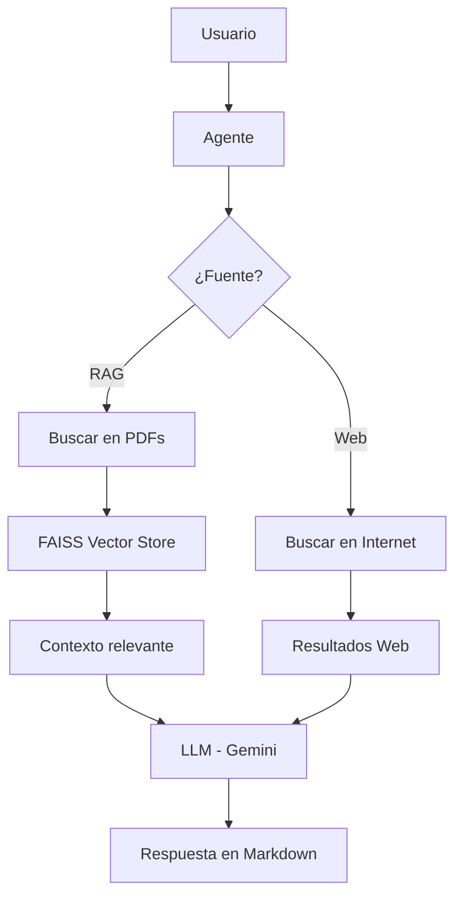

# 🤖 Inmersión en Agentes de IA — Clase 2

Repositorio con un notebook de trabajo para explorar la construcción de agentes de IA usando embeddings, búsqueda vectorial y modelos generativos.

---

## 🧠 ¿Cómo funciona el sistema?

Este proyecto implementa un pipeline RAG:

1. 📄 Carga de PDFs
2. ✂️ División en fragmentos (chunking)
3. 🔍 Generación de embeddings
4. ⚡ Almacenamiento en FAISS
5. 📚 Recuperación de contexto relevante
6. 🤖 Generación de respuestas con LLM

---

## 📂 Contenido

```bash id="r9t8e2"
.
├── Inmersión_Agentes_de_IA_Alura_Clase_2_+3_Orli.ipynb
├── Inmersión_Agentes_de_IA_Alura_Clase_2_Orli.ipynb
├── README.md
└── LICENSE
```

---

## 🧠 Descripción

El proyecto está centrado en un único notebook ejecutado en Google Colab.
Incluye experimentación con:

* 🔍 Generación de embeddings
* ⚡ Creación de vector stores (FAISS)
* 📚 Búsqueda semántica
* 🤖 Integración con APIs de modelos

---

## ⚙️ Requisitos

* 🐍 Python 3.10+
* 📓 Cuenta en Google Colab (recomendado)
* 🔑 API Key para el proveedor de embeddings (si aplica)
  * Google Gemini
  * SerpAPI 

---

## 🧩 Tecnologías utilizadas

* LangChain
* FAISS
* Google Gemini
* SerpAPI
* LangGraph

---

## 🚀 Uso

1. Clonar el repositorio:

```bash id="t2v7hk"
git clone https://github.com/Orliluq/Inmersion_Agentes_de_IA_Alura_Clase_2.git
cd Inmersion_Agentes_de_IA_Alura_Clase_2
```

2. 📂 Abrir el notebook en Colab o entorno local

3. ▶️ Ejecutar las celdas en orden

---

## 🔄 Flujo del sistema clase 2

Datos → Embeddings → **Vector Store → Retrieval** → LLM → Respuesta

---

# 🤖 Inmersión en Agentes de IA — Clase 3

---

## 🧠 ¿Cómo funciona el sistema?

Este proyecto implementa un pipeline RAG extendido con capacidad de decisión:

1. 📄 Carga de PDFs  
2. ✂️ División en fragmentos (chunking)  
3. 🔍 Generación de embeddings  
4. ⚡ Almacenamiento en FAISS  
5. 📚 Recuperación de contexto relevante  
6. 🤖 Generación de respuestas con LLM  
7. 🌐 Integración con búsqueda web  
8. 🧭 Selección automática de fuente (RAG o Web)  

---

## 🧠 Arquitectura del agente

El sistema implementa un agente híbrido que decide dinámicamente cómo responder:



## 🔄 Flujo del sistema clase 3

Pregunta → Clasificación → **(RAG 🧠 | Web 🌐)** → Contexto → LLM → Respuesta

---

## 🧠 Lógica del agente

El agente analiza cada pregunta y decide:
* 📄 RAG → si la pregunta está relacionada con los documentos cargados
* 🌐 Web → si requiere información externa o general

**Esto permite:**
* Mayor precisión en datos internos
* Mayor cobertura en preguntas abiertas

---

## 🎯 Ejemplos

**Pregunta:** "¿Dónde se concentró el mix de productos?"
→ Usa RAG (documentos internos)

**Pregunta:** "¿Cuántos mundiales tiene Brasil?"
→ Usa Web (información general)

---

## 📌 Resultado

El sistema evoluciona de un buscador de documentos a un agente inteligente que:
* Decide cómo responder
* Combina múltiples fuentes
* Genera respuestas estructuradas

---

## ⚠️ Notas

* 🚫 El procesamiento de embeddings puede estar limitado por cuotas del proveedor (ej: errores 429).
* ✂️ Se recomienda trabajar con subconjuntos de datos durante pruebas.
* 🧠 Para uso intensivo, considerar embeddings locales o planes pagos.

---

## 📜 Licencia

MIT

---

## ✨ Autor

Construido por Orli 🧠⚡
